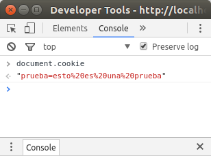

## Manejo de cookies en Express
### ¿Qué son las cookies?

Las cookies es la vía que existe en html para dar persistencia. Como sabemos, el estándar html por si solo no permite guardar información acerca del estado en el que se encuentran las transacciónes que se realizan, por lo que no se podría almacenar información ni personalizar el contenido que se muestra, por ejemplo: un servicio web no sabría si las peticiones que llegan son de un usario logeado o no.

Para resolver este problema existen las cookies, son pequeñas cantidades de datos que se generan en el servidor, y que el cliente envía en cada petición, de esta manera, modificando variables dentro de esos datos, se puede guardar información acerca del cliente y el servidor es capaz de devolver una respuesta personalizada.

### Cookie-parser
Cooke-parser es el paquete de node que proporciona las funciones necesarias para la generación y manejo de cookies en servidores creados con express.

Este paquete hace uso de los paquetes **cookie** y **cookie-signature**, permitiendo acceder de una manera más simple a las fucinoes que ofrecen los dos paquetes nombrados.

Para la instalación de cookie-parser recurrimos al gestor de paquetes de node (npm), en linux, nos dirigimos a la carpeta que contine nuestro proyecto y en un terminal ejecutamos el siguiente comando:
~~~bash
$ npm install cookie-parser
cookie-parser
~~~

Para hacer uso de cookie parser en el servidor que estemos diseñando necesitamos importarlo en el fichero javascript en que lo necesitemos:
~~~javascript
var express = require('express');
var cookieParser = require('cookie-parser');
var app = express();
app.use(cookieParser());
~~~

### Sintaxis:
Cookie-parser parsea las cookies que vienen en la cabecera del request y las convierte en un objeto req.cookies etiquetado con los nombres de cada cookie, p.e:
~~~javascript
 req.cookies.user
~~~
Para crear una nueva cookie se define una nueva ruta en la app que estemos diseñando e indicamos la cookie antes de enviar la respuesta:
~~~javascript
app.get('/cookie',function(req, res){
     res.cookie(cookie_name , 'cookie_value').send('Cookie is set');
});
~~~
Para comprobar si una cookie se está creando, simplemente vamos a la consola de las herramientas de desarrollo del navegador y tecleamos document.cookie:

Una vez generada la cookie en el servidor, el navegador del cliente envía esta de vuelta en cada petición que hace al servidor, añadiéndola a la cabecera de dicha petición, de esta manera, para acceder a las cookies simplemente recurrimos al objeto req.cookie y podremos acceder a la misma en el servidor.

~~~javascript
app.get('/', function(req, res) {
  console.log("Cookies :  ", req.cookies);
});
~~~
### Extablecer el tiempo de validez de una cookie:
Cookie expire time can be set easily by :
A las cookies se le pueden pasar parámetros en el momento de su creación pasándole un objeto, con parejas de parámetro y valor. Existe dos formas de establecer un tiempo de valides para una cookie.
* La primera de es establecer la fecha de expiración en miliseguntos:
~~~javascript
res.cookie(name , 'value', {expire : new Date() + 9999});
~~~
* La segunda forma es estableciendo su máxima duración mediante el parámetro maxAge:
~~~javascript
res.cookie(name, 'value', {maxAge : 9999});
~~~

### Como eliminar una cookie

Para eliminar una cookie existente simplemente es necesario hacer uso del método clearCookie, indicando como parámetro el nombre asignado a la cookie que se pretende eliminar:
~~~javascript
app.get('/clearcookie', function(req,res){
     clearCookie('cookie_name');
     res.send('Cookie deleted');
});
~~~

### Métodos de la API:

#### cookieParser(secret, options)

- `secret` String utilizado para firmar la cookie, si no se pasa el parámetro, la cookie no será firmada.
- `options` Objeto que se pasa como parámetros para la creación de la cookie. Detalles: [cookie](https://www.npmjs.org/package/cookie).
  - `decode` función para decodificar los valores de la cookie.

#### cookieParser.JSONCookie(str)
Parsea los valores de la cookie como objeto json.

#### cookieParser.JSONCookies(cookies)

Itera sobre los valores del objeto que se pasa como parámetro llamando a `JSONCookie` con cada valor.

#### cookieParser.signedCookie(str, secret)

Parsea la cookie como una cookie firmada, el argumento `secret` es la cadena empleada para firmar la cokie.

#### cookieParser.signedCookies(cookies, secret)

Itera solbre los objetos en cookies llamando a `signedCookies` con cada uno de los valores. `secret` puede ser un valor o un array de valores.
